# Project_3

Selected Country: Cameroon

I chose to work with Cameroon because it's the same country that i used in project 2 where we used demographic and housing data to predict wealth outcomes. 
Cameroon is a relatively large country in Central Africa and it is home to approximately 25.88 million people. Below is a population density map of Cameroon and it shows that most of the population is situated in the northern half of the country. Interestingly not a lot of people like to live on the coast. About 20% of the land is used for agriculture and 41% of the land is covered by forests. Most of this forest land is located in the southern part of the country which explains why the population is concentrated in the northern half of the country.

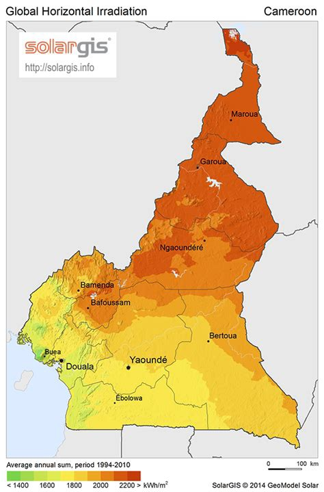

Below is a map of Cameroon and it's primary administrative regions.

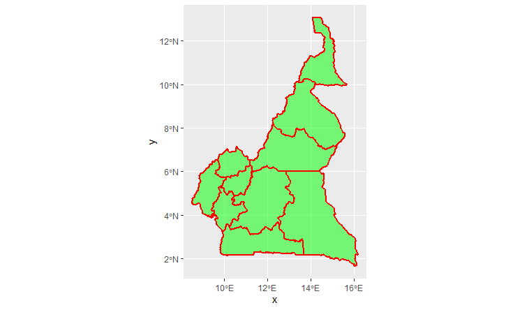

I also decided to focus on the region Adamaoua since my computer didn't want to hand over any extra RAM.
Below is a plot of the region as well as its subdivisions.

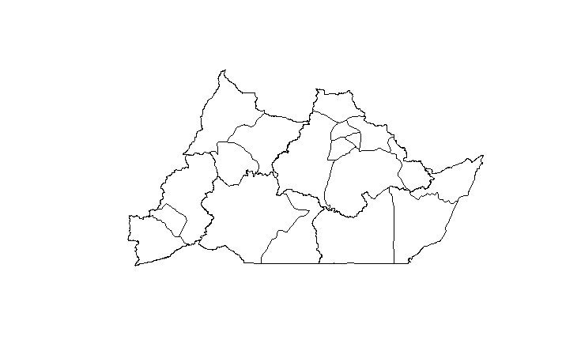

## Linear Regression

Plot showing predicted population sums

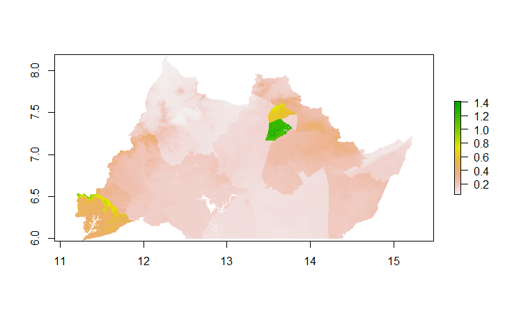

Plot showing difference between real population sums and the predicted values (MAE plot). 
From this graph we can see that the model tends to overpredict population values for city areas, most noticeably for the city of Ngaoundere.
For easy interpretation < 0 is an overprediction (yellow areas on the map) and > 0 is an underprediction.
Strangely enough the model tended to underpredict which is represented by the dark green.

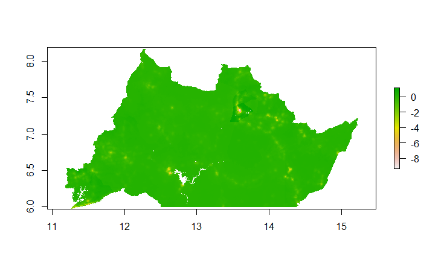

Below is a 3D plot of the difference between real population sums and the predicted values. Anywhere you see a hole on this plot is where the model overpredicted. 
Once again we see the most variation in the city areas. An explanation for this may be that 

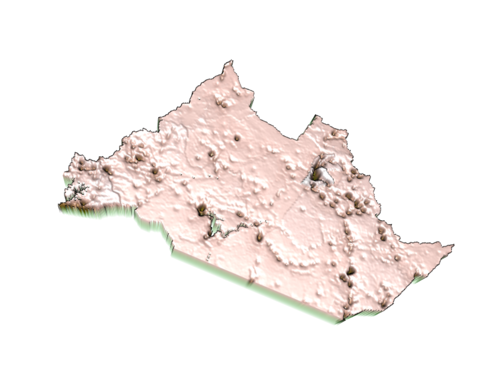

## Random Forest

The most important variable according to this model is sum.ntl.

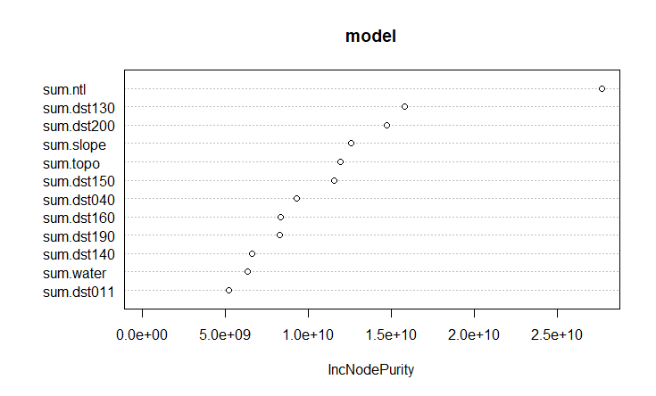

Below is a plot of the model error as it decreases with the addition of more trees.

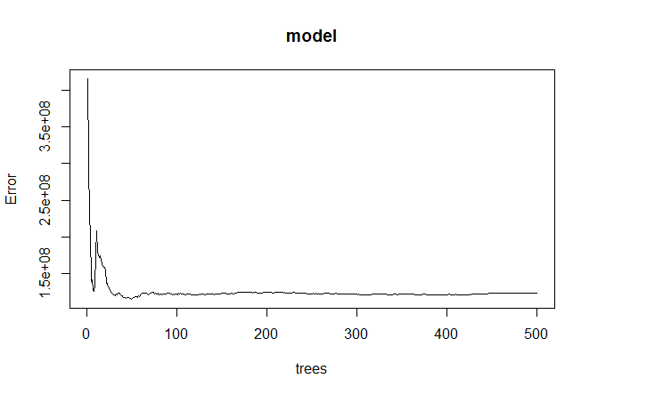

Plot showing predicted population sums

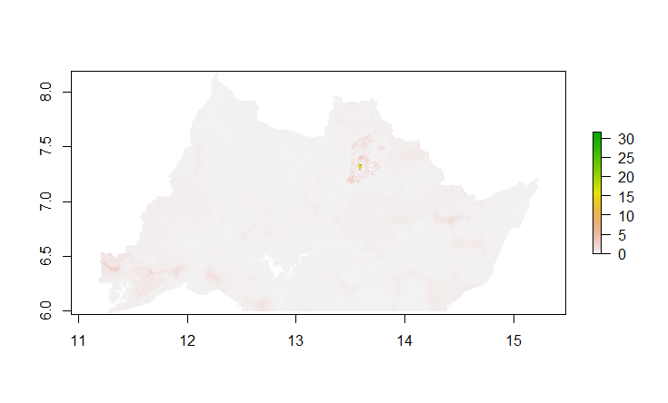

Plot showing difference between real population sums and the predicted values. (MAE plot)
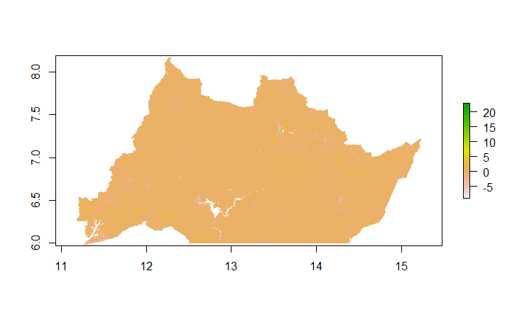

Below is a 3D plot of the difference between real population sums and the predicted values of the random forest model. Anywhere you see a hole on this plot is where the model overpredicted and anywhere you see a mountain means the model underpredicted population values.

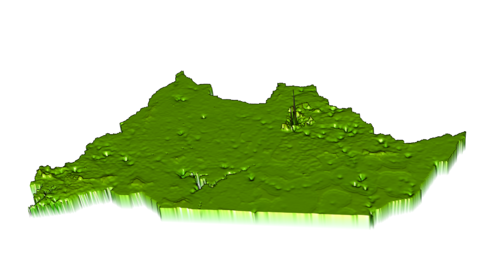

Both the LR model and the RF model tended to underpredict however, in areas like large cities the models tended to overpredict. Given that the most important variable is night time light and cities generally tend to have more lights on average than other areas this may explain why the model tended to overpredict for these areas. To improve this I think we could add special weights to the values for city areas to help with the overpredictions.

